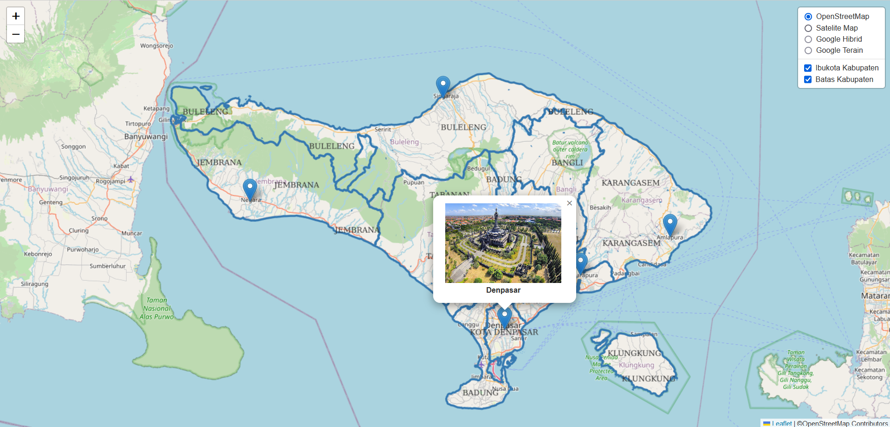

# Membuat Webgis sederhana dengan LeafletJS
#### Download repository ini untuk memulai
#### Bisa download langsung berupa zip atau git clone
#### Ikuti langkah di bawah ini, pada file /js/main.js

## Inisialisasi basemap dan Map
Basemap
```javascript
    // List Basemap
var openStreetMap = L.tileLayer('https://{s}.tile.openstreetmap.org/{z}/{x}/{y}.png', {
    attribution: '©OpenStreetMap Contributors',
});

var satelliteMap = L.tileLayer('https://mt1.google.com/vt/lyrs=s&x={x}&y={y}&z={z}', {
    attribution: '©Google Satellite Map',
    subdomains: ['mt0', 'mt1', 'mt2', 'mt3'],
    maxZoom: 20
});

var googleHibridMap = L.tileLayer('http://{s}.google.com/vt?lyrs=s,h&x={x}&y={y}&z={z}', {
    attribution: '©Google Hybrid Map',
    subdomains: ['mt0', 'mt1', 'mt2', 'mt3'],
    maxZoom: 20
});

var googleTerrain = L.tileLayer('https://{s}.google.com/vt/lyrs=p&x={x}&y={y}&z={z}', {
    maxZoom: 20,
    subdomains: ['mt0', 'mt1', 'mt2', 'mt3'],
    attribution: '©Google Terrain'
});
```

Map di element HTML id = "map"
```javascript
var map = L.map('map', {
    <!-- kordinat bali -->
    center: [-8.334039, 115.1043217],
    zoom: 10,
    layers: openStreetMap
});
```

## Menampilkan marker
```javascript
// Menambahkan marker
var location1 = L.marker([-8.116546075955435, 115.08772076821784]).bindPopup('This is Marker Location UNDIKSHA')
location1.addTo(map)
```
## Membuat LayerGrup
```javascript
// Membuat layerGrup
var marker1 = L.layerGroup([location1]);
var ibukota = L.layerGroup();
var batasKab = L.layerGroup();
```

## Membuat kontrol layer dan basemap
```javascript
// Kontrol layer
var overlayMaps = {
    "Marker": marker1,
    "Ibukota Kabupaten": ibukota,
    "Batas Kabupaten": batasKab,
};

// Kontrol basemap
var baseMaps = {
    "OpenStreetMap": openStreetMap,
    "Satelite Map": satelliteMap,
    "Google Hibrid": googleHibridMap,
    "Google Terain": googleTerrain,
};
```

## Menambahkan kontrol layer ke maps
```javascript
// Menambahkan kontrol layer ke peta
var layerControl = L.control.layers(baseMaps, overlayMaps).addTo(map);
```

## Menampilkan data Geojson Ibukota di bali
### fetch data geojson
```javascript
// Mengambil GeoJSON dari file lokal
fetch("geojson/ibukota.geojson")
    .then(response => response.json())
    .then(data => {
        // Membuat layer GeoJSON
        var geojsonLayer = L.geoJSON(data, {
            onEachFeature: function (feature, layer) {
                // Konten popup
                var popupContent = '<div style="width: 200px;" ><br>';
                popupContent += "<b><center>" + feature.properties.name + "</center></b></div>";

                layer.bindPopup(popupContent);
            }
        });
        // Menambahkan layer GeoJSON ke grup ibukota
        geojsonLayer.addTo(ibukota);
    })
    .catch(error => console.error("Error fetching GeoJSON:", error));
```

## Menampilkan layer batas kabupaten di bali dari Geoserver Web Map Service (WMS)
Tile layer wms
```javascript
// Menambahkan layer dari GeoServer WMS
// url wms layer di geoserver
L.tileLayer.wms('http://geoserver.wefgis-sync.com:8585/geoserver/bali/wms', {
    // nama layer di geoserver
    layers: 'bali:batas-kabupaten-bali',
    format: 'image/png',
    transparent: true
}).addTo(batasKab);
```

## Hasil Webgis
Jika sudah mengikuti semua langkahnya, maka anda akan berhasil untuk membuat webgis seperti tampilan di bawah ini.
